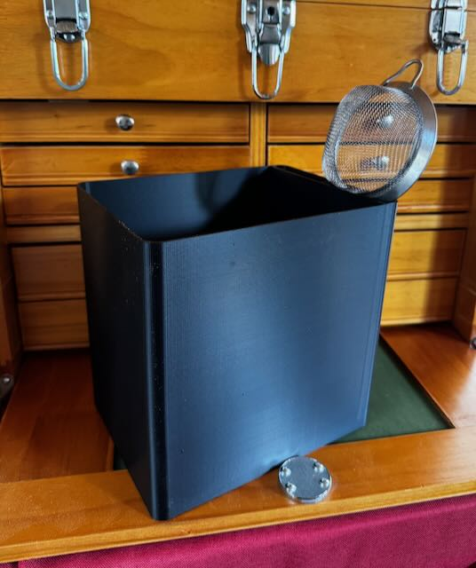

# Sink Waste Bin

Simple waste bin for next to our sink. It has a slot to one side where we can put our strainer that we use to
filter coffee grounds so that they do not go down the drain. The intent is to capture food
scraps for later composting.

The model is parametric so you can customize it to fit your needs.

## Model Parameters

| Parameter       | Description                                                                                        |
| --------------- | -------------------------------------------------------------------------------------------------- |
| bin_width       | Overall Width of the waste bin. The side slot will be within this width.                           |
| add_side_slot   | True indicates if there should be a side slot.Width of the side slot.                              |
| side_slot       | Width of the side slot. Used if add_side_slot is true.                                             |
| bin_depth       | Depth of the waste bin.                                                                            |
| bin_height      | Overall height of the waste bin.                                                                   |
| wall_thickness  | Thickness of the walls for the waste bin.                                                          |
| corner_rounding | Rounding of the outside corners.                                                                   |
| add_bag_slot    | True to cut in slots for a bag to be folded in to.                                                 |
| bag_slot_len    | How long to make the bag slot as measure from the top fo the bin. Used if a add_side_slot is true. |
| bag_slot_width  | Width of the bag slot.                                                                             |
|                 |                                                                                                    |

## Dependencies and Using the Component

This model is built using the tools listed below. Install these tools and you can open up the SCAD file in this repo to create your own printable object.

- [OpenSCAD](https://openscad.org)
- [The Belfry OpenScad Library, v2.0.](https://github.com/BelfrySCAD/BOSL2)

The `*.3mf` file in this repo is a [Orca Slicer](https://orcaslicer.com) project files used to print the model on our Prusa MK3S+.

## Example Output

